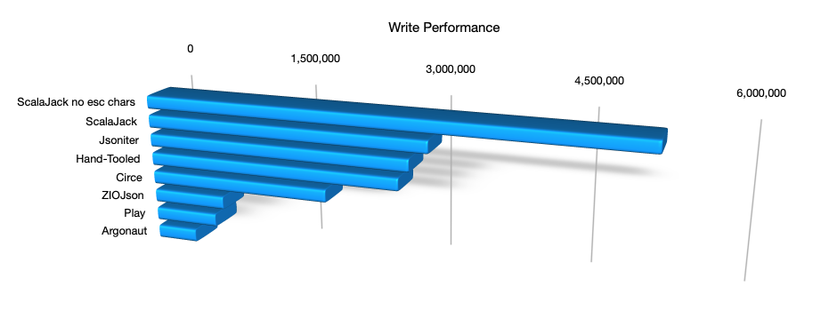

# Performance

JSON serialization benchmarks I found in various project repos often measured (IMO) silly things like how fast 
a parser could handle a small list of Int.  For this benchmark I used a small, but slightly more representative model.  
It has some nested objects and collections that make it a more interesting test.

The test is run via jmh.  The JVM is **stock**--not tuned to within an inch of its life, to be a more realistic 
use case.

Run benchmark from the ScalaJack/benchmark directory (not the main ScalaJack project directory): 
```
sbt "jmh:run -i 10 -wi 10 -f 2 -t 1 co.blocke.*"
```

## Reading Performance:


| Benchmark        | Mode  | Count  |           Score |        Error | Units |
|------------------|-------|-------:|----------------:|-------------:|-------|
| Jsoniter         | thrpt |  20    |    1346388.345  |  ± 17028.863 | ops/s |
| **ScalaJack 8**  | thrpt |  20    |   **986597.070**|  ± 7473.148 | ops/s |
| ZIOJson          | thrpt |  20    |     590995.917  |  ±   817.817 | ops/s |
| Circe            | thrpt |  20    |     210805.946  |  ± 32488.564 | ops/s |
| Play             | thrpt |  20    |     198747.067  |  ±  7253.896 | ops/s |
| Argonaut         | thrpt |  20    |     183670.032  |  ±  8981.485 | ops/s |

## Writing Performance:



| Benchmark        | Mode  | Count  |           Score |        Error | Units |
|------------------|-------|-------:|----------------:|-------------:|-------|
|**ScalaJack 8**   | thrpt |  20    | **3039273.222** |  ± 14952.932 | ops/s |
| Jsoniter         | thrpt |  20    |     2843150.452 |  ± 21478.503 | ops/s |
| Hand-Tooled      | thrpt |  20    |     2732571.374 |  ± 15129.007 | ops/s |
| Circe            | thrpt |  20    |     1958244.437 |  ± 23965.817 | ops/s |
| ZIO JSON         | thrpt |  20    |      794352.301 |  ± 32336.852 | ops/s |
| Argonaut         | thrpt |  20    |      690269.697 |  ±  6348.882 | ops/s |
| Play JSON        | thrpt |  20    |      438650.022 |  ± 23800.221 | ops/s |

**Note:** Exact numbers aren't terribly important--they may vary widely depending on the platform
used.  The important thing is the relative relationship between libraries given all tests
were performed on the same platform.

### Interpretation

Performance for ScalaJack has been a journey.  ScalaJack is a mature product--over 10 yrs old.
Long ago it was quite fast vs its competition, but over the years its performance lagged 
considerably as its peers improved, to the point that it was one of the slower serialization
libraries.  ScalaJack 8 changes that!  

I was sampling and testing against a collection of popular serializers for Scala util
something quite unexpected happend: I discovered Jsoniter.  Its performance was through
the roof!  It far outpaced all competitors for raw speed.  This was a shock.  I had to 
learn how this worked.

So full credit where credit is due:  ScalaJack 8's reading/writing codec architecture 
is heavily informed from Jsoniter, so I'll post their licence here:

[Jsoniter's License](https://github.com/plokhotnyuk/jsoniter-scala/blob/af23cf65a70d48834b8fecb792cc333b23409c6f/LICENSE)

There are a number of optimizations and design choices I elected not to bring over from
Jsoniter, in many cases because ScalaJack doesn't need them for its intended feature set.
Of course ScalaJack utilizes our own macro-driven scala-reflection library to great effect, 
which Jsoniter does not.

Jsoniter achieves its neck-breaking speed by going deep--very deep into macro code
generation.  They also use a lot of low level byte arrays and bitwise operators, much as you'd 
expect to see in a C program, to improve on the standard library functions everyone else uses.  
It works.

### Technical Notes

Achieving extreme speed for ScalaJack 8 was weeks of learning, trial, error,
and re-writes.  I studied Jsoniter, Circe, ZIO Json, and others to learn optimizations.
The tough news for anyone wanting to duplicate this kind of performance in your own code 
is that there isn't one magic trick to achieve maximum performance.  It's a basket 
of techniques, each achieving small marginal gains that add up, and you must decide when 
enough is enough for you.  Here's a partial list of learnings incorporated into ScalaJack 8:

* Being careful when using .asInstanceOf[]... in fact try to avoid it wherever possible 
  as it messes up CPU cache, harming performance.  This means a lot of very careful type
  management, and its why you see the RTypeRefs from scala-reflection are now all typed
  in the latest version

* Lots of specific typing.  Don't make the compiler think--provide detailed types wherever 
  you can

* In some cases (though not all) a series of if/else if/else statements is faster than 
  match/case statements

* A carefully-crafted @tailrec function is often faster than a function driven by a 
  while loop.

* For macro-based software like this--find every opportunity to do hard work at 
  compile-time

* Be mindful of what code your macros generate!  You can paint by the numbers with quotes and
  splices, like the documentaion and blogs suggest, and you will get something working. 
  When you examine the code a "stock" macro use produces, you may be disappointed
  if ultimate runtime speed is your goal. Then generated code might look a litle kludgy, and
  it will likely not be speed-optimized. Rework your macros carefully until the generated code 
  is as smooth as you might write by hand.  Remember: your macro code doesn't have to win awards for 
  style or beauty--your generated code does!  For the fastest performance you'll actually have 
  to generate custom functions as shown in ScalaJack's code (look at JsonCodecMaker.scala)  This 
  isn't for the faint of heart.  If it all looks like Greek, step back and layer yourself into 
  macros slowly a piece at a time.

After all the performance tunings and learnings, I was able to meet or beat Jsoniter for writing
speed, putting ScalaJack at the top of the pile.  For reading I made a number of substantial 
improvements that placed ScalaJack a strong 2nd place under Jsoniter.  There is still a 
substantial performance gap between Jsoniter's reads and ScalaJack's, and for the life of me I can't
figure out what's driving those gains.  The generated code is very similar.  Json parsing should
be similar--in fact in some ways ScalaJack's should be faster.  Although micro-benchmarks indicate
match/case is significantly slower, in practice replacing these with if/else didn't gain ScalaJack
a thing--which I find vexing.  Jsoniter has some tricky ByteArrayAccess code that looks very
low-level and clever, but when I benchmarked it, the gains seemed moninal to none in my use case.
I dunno--If anyone has any ideas, please drop a comment in the Issues in repo!